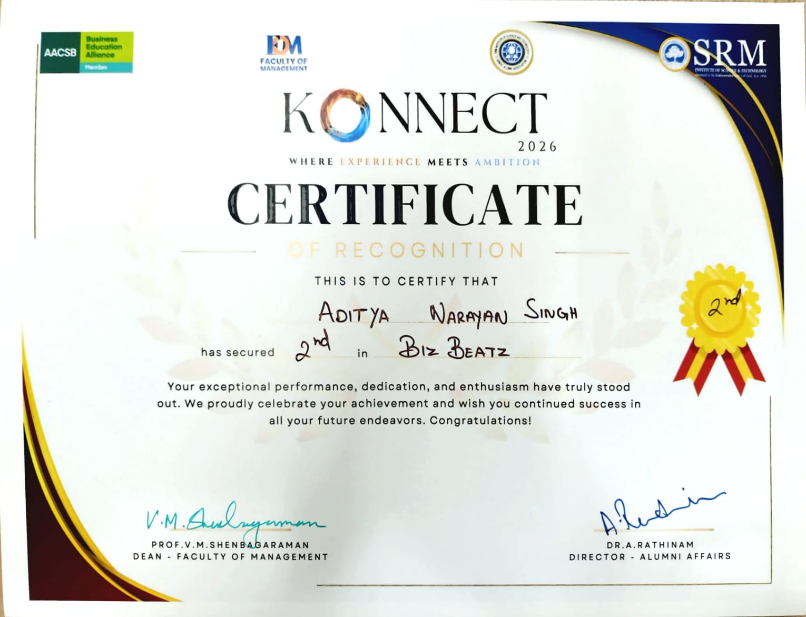

# Achievements & Certificates

Welcome to my personal archive of achievements, certificates, awards, medals,
and completed courses. This repository documents the milestones I earn through
competitions, learning, and other academic or extracurricular activities.

---

## 🏆 Achievements Included

### Konnect 2026 — Biz Beats

* **Achievement:** Secured **2nd position**
* **Competition:** Biz Beats
* **Event:** Konnect 2026
* **Institution:** SRM Institute of Science and Technology, Kattankulathur
* **Recognition:** Certificate of Recognition
* **Certificate:** [`konnect-2026-biz-beats-2nd-position.jpg`](konnect-2026-biz-beats-2nd-position.jpg)

---

## 📚 Archive Format

New achievements will be added directly to the repository using descriptive
filenames such as:

`2026-python-course-certificate.jpg`

Each entry should include the achievement, event or course, organization, date
when available, and a link to the supporting photo or document.

---

## 📈 Future Additions

This repository will continue to grow as I participate in more competitions,
complete courses, and reach new milestones.
